layout: true

.signature[@algogrit]

---

class: center, middle

# An investigative walk through of Go's Channels

##### Alternatively - Learning about Go's channels

### Gaurav Agarwal

---

# Agenda

* Audience poll
* Program walk through
* Deep dive into Channel's internals
* Short Demo (if Demo Gods permit!)

---

class: center, middle

# 🙋

## How many of you are students or are new to programming?

# 🙋‍♂️

---

class: center, middle

# 🙋‍♂️

## How many of you are familiar with the Go programming language?

# 🙋

---

class: center, middle

# 🙋‍♂️🙋

## How many of you are familiar or have worked with Go's concurrency?

# 🙋🙋‍♂️

---

class: center, middle

# Simple Scraper


.image-credits[Renee French]

---

# Scraper

.left-column[
Scrape for a particular type of products: TV
]

.right-column[
  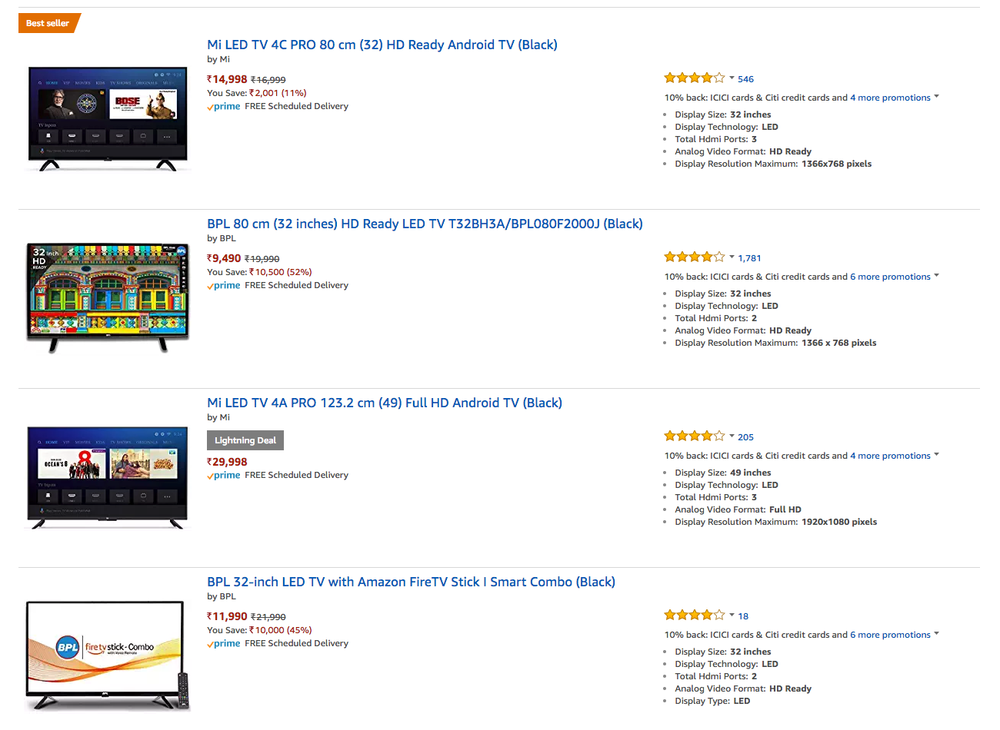
]

.image-credits[https://www.amazon.in/]

---

# Scraper

.left-column[
For each product,

Get **name**, **image**, **price** and **link**
]

.right-column[
  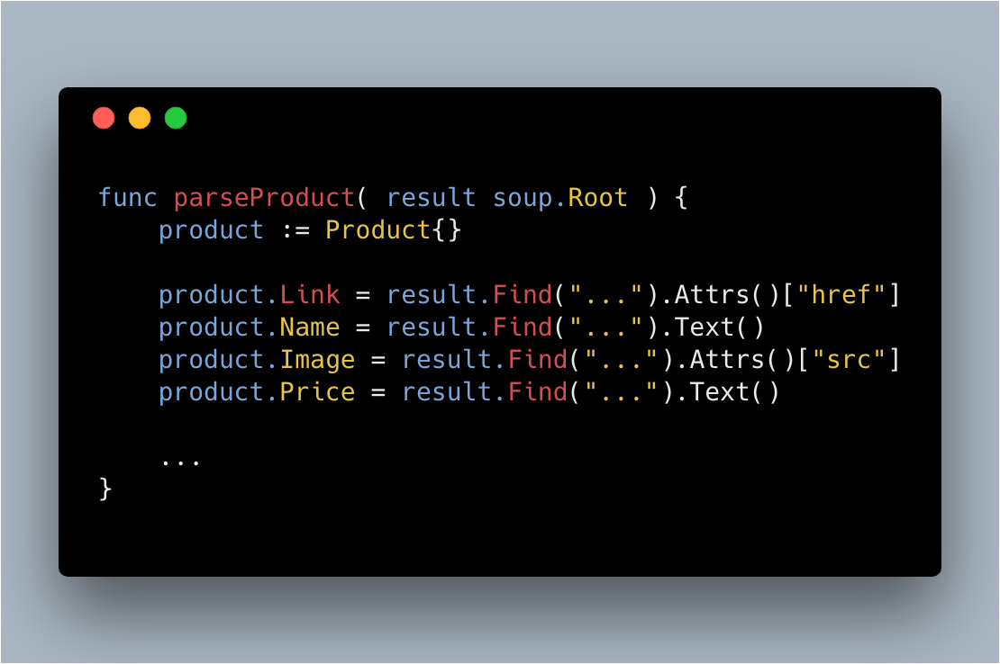
]

.image-credits[https://carbon.now.sh/]

---

# Scraper

.left-column[
Visit product page **link**, and get **reviews**
]

.right-column[
  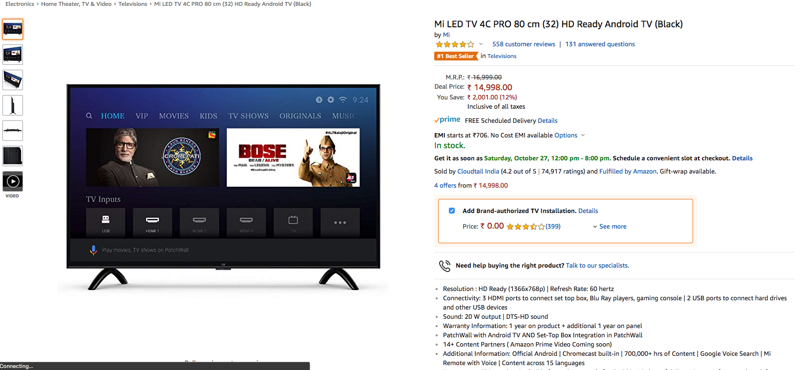
]

.image-credits[https://www.amazon.in/]

---

# Scraper

.left-column[
For each review in a product page,

Get **name**, **rating**, **content**
]

.right-column[
  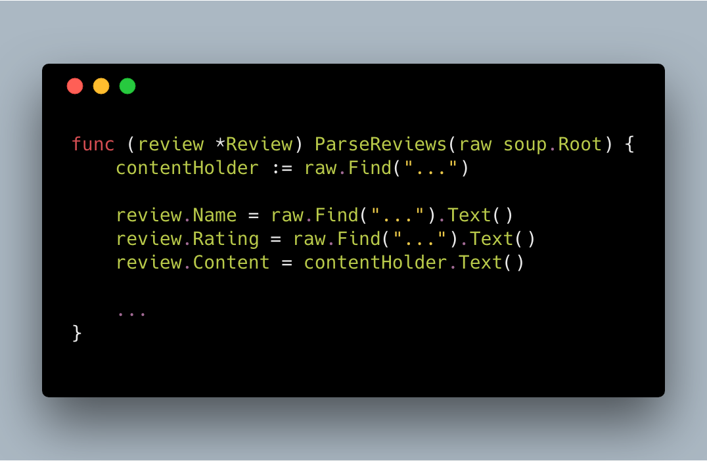
]

.image-credits[https://carbon.now.sh/]

---

# Scraper

.left-column[
Tying it all together,
]

.right-column[
  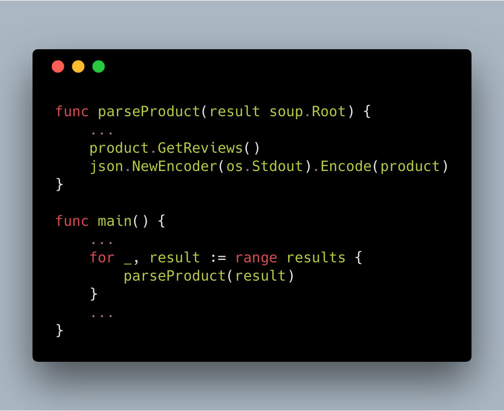
]

.image-credits[https://carbon.now.sh/]

---

# Output

```json
{
  "Name": "Sanyo 108.2 cm (43 inches) Full HD IPS LED TV XT-43S7100F (Black)",
  "Link": "https://www.amazon.in/Sanyo-108-2-inches-XT-43S7100F-Black/dp/B01ICVLK4S/ref=lp_1389396031_1_5/260-5276449-2035623?s=electronics&ie=UTF8&qid=1540385124&sr=1-5",
  "Image": "https://images-eu.ssl-images-amazon.com/images/I/51F0yKjVX1L._AC_US218_.jpg",
  "Price": "17,990",
  "Reviews": [
    {
      "Name": "Cooper Vrf",
      "Rating": "5.0 out of 5 stars",
      "Content": "Much has been said about the clarity and performance of the TV. Yes its a great value for money product, but here I am going to say about the customer service part. After using my 49 inch TV for about 21 months one day my TV went black. I could hear only the sound but no picture. I emailed the Sanyo customer care and within four hours a service person called me and fixed the appointment for very next day. The next day he inspected the TV and told that the panel has gone dead and they will have to change the panel. As my TV was under 2 year warranty he assured me that the company will possibly replace the panel and it could be done within 10 days. I was very much skeptical about the panel replacement as the next day I received an email from the company saying that they will be taking all possible actions to solve my query but no mention of panel replacement. After about a week I received a call from their service center in Bilimora that my tv has arrived and the service person is coming to install it. Even though it was raining heavily on that day he came right on time and to my amazement he brought out from his car a whole new TV box. Believe me the company has replaced a whole new tv in place of the old one, only the two boards from my old tv were fixed on the new one. Really hats off to the Company's customer service and special mention to their service centre in Bilimora which got the job done on time even in heavy rainfall and even though my hometown is about 25 kms away. Within the next two hours I received three calls from the company regarding my query solved. Thanks Sanyo..... Really satisfied on buying your company's TV."
    },
    {
      "Name": "Debasish Sen",
      "Rating": "4.0 out of 5 stars",
      "Content": "Great clarity. Decent sound. A cracking deal at this price."
    },
    {
      "Name": "Naziruddin",
      "Rating": "4.0 out of 5 stars",
      "Content": "A good tv for the exchange price.Good reception n colours.Gurantee card does not say 10 years tv panel warranty but mentioned on the web site of the Tv,hopefully it's  true. Worth buying."
    }
  ]
}
```

---

# Concurrent Scraper

.left-column[
Tying it all together concurrently, using **goroutines** and **channels**
]

.right-column[
  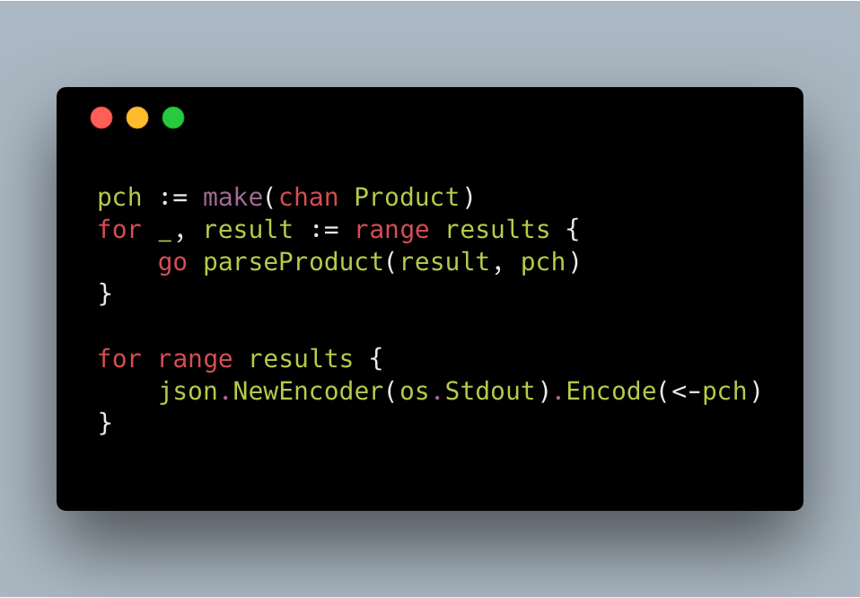
]

.content-credits[https://www.youtube.com/watch?v=JqNpNpb5TlQ]
.image-credits[https://carbon.now.sh/]

---

class: center, middle

# Deep dive into Go's channel

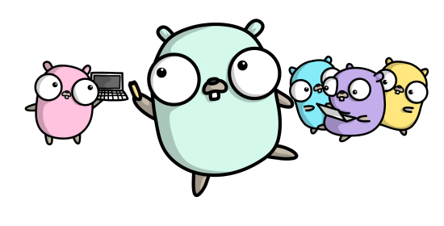

.image-credits[Renee French]

---

# make(chan, _n)

.center.middle[
## buffered channel
ch := make(chan Product, 3)

## unbuffered channel
ch := make(chan Product)
]
---

# Using delve to watch the state of channel

### Writing to channel


### Reading from channel


---
class: center, middle

## Channel Structure

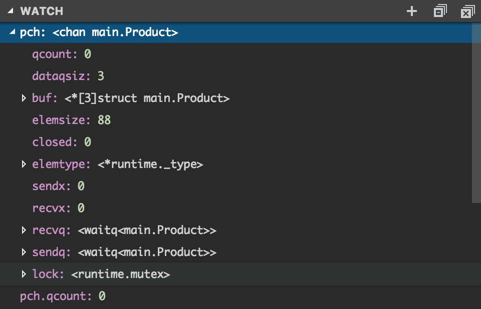

---

### `hchan` struct

  * Type information
  * Buffers & queues
  * Counters
  * Locks & flags

---

.left-column[
#### Type information

  * elemsize
  * elemtype
]

---

.left-column[
#### Type information

  * **elemsize**
  * elemtype
]

.right-column[
  Represents the size of a single element in memory in bytes

  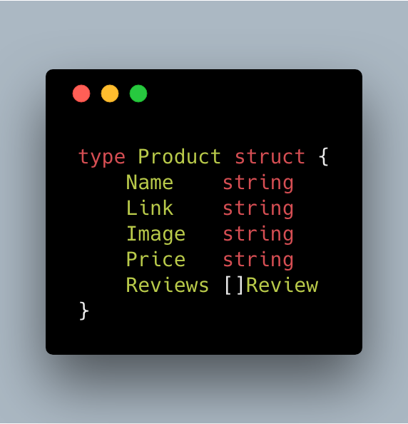
]

---

.left-column[
#### Type information

  * **elemsize**
  * elemtype
]

.right-column[
  Takes 88 bytes...

  Type `int` takes 8 bytes.
]

---

.left-column[
#### Type information

  * elemsize
  * **elemtype**
]

.right-column[
  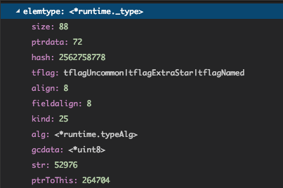

  It consists of proper type information. This informaiton is used when the messages are copied over from one goroutine to the other.
]

.content-credits[https://golang.org/src/runtime/chan.go?m=text]

---

.left-column[
#### Buffers

  * **buf**

#### Queues

  * recvq
  * sendq
]

.right-column[
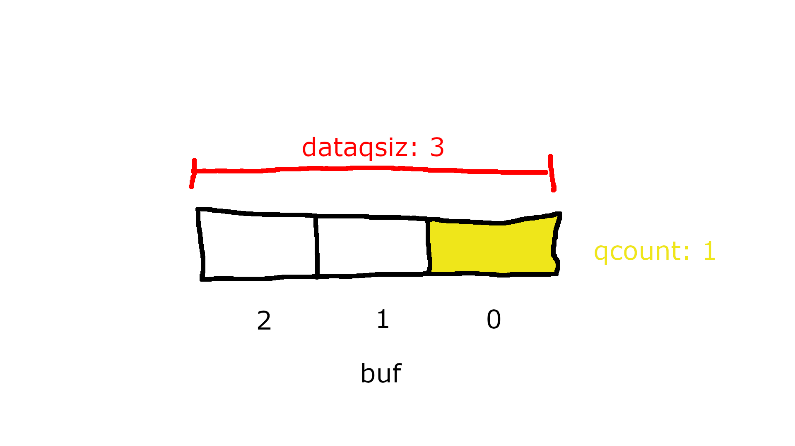
]

---

.left-column[
#### Buffers

  * buf

#### Queues

  * **recvq**
  * **sendq**
]

.right-column[
## sudog

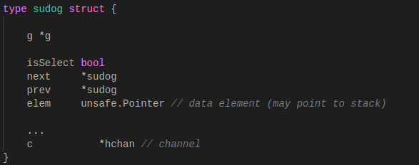
]

.content-credits[Ankur Anand's https://codeburst.io/diving-deep-into-the-golang-channels-549fd4ed21a8]

---

.left-column[
#### Buffers

  * buf

#### Queues

  * **recvq**
  * sendq
]

.right-column[
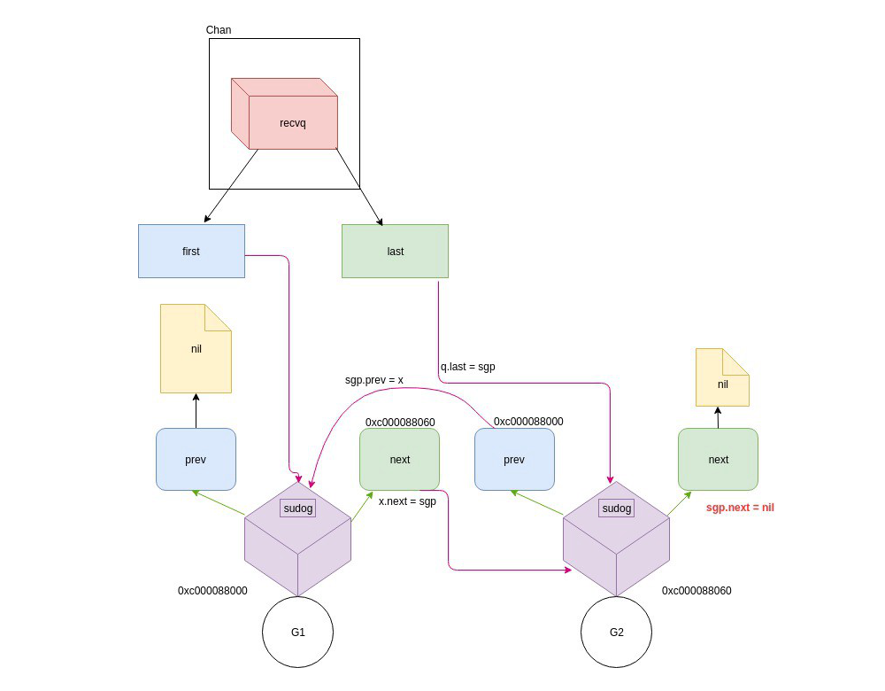
]

.image-credits[Ankur Anand]

---

.left-column[
#### Counters

  * qcount
  * dataqsiz
  * sendx
  * recvx
]

.right-column[
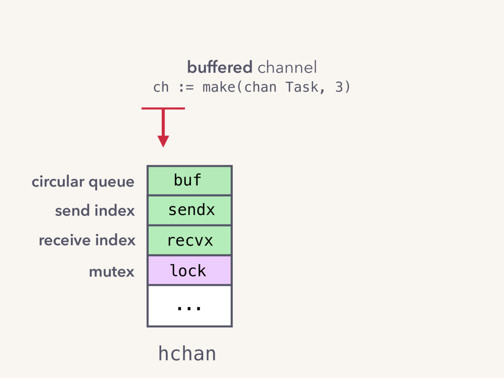
]

.content-credits[Kavya Joshi's https://speakerdeck.com/kavya719/understanding-channels?slide=14]

---

.left-column[
#### Counters

  * qcount
  * dataqsiz
  * **sendx**
  * **recvx**
]

.right-column[
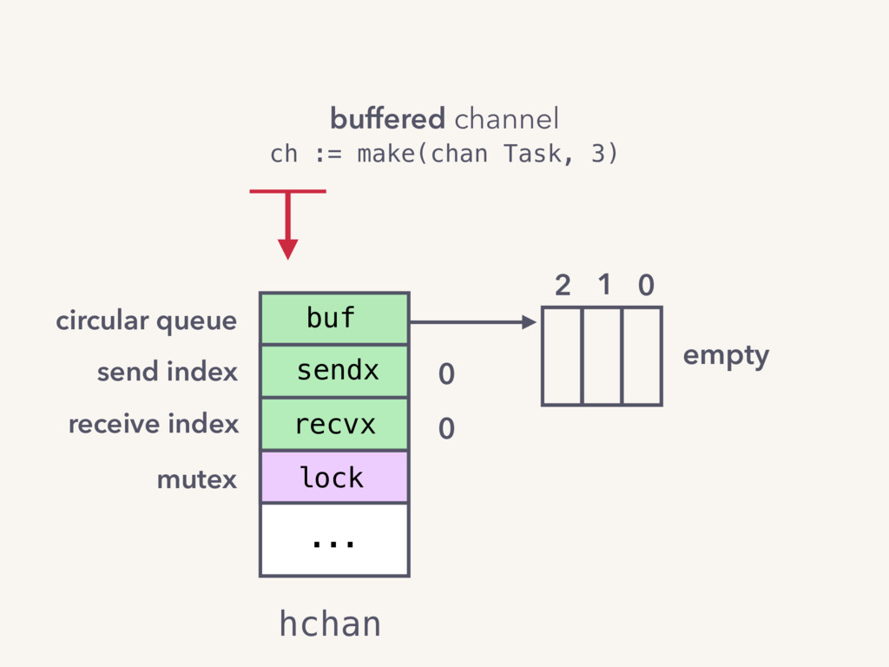
]

.content-credits[Kavya Joshi's https://speakerdeck.com/kavya719/understanding-channels?slide=15]

---

.left-column[
#### Counters

  * qcount
  * dataqsiz
  * **sendx**
  * **recvx**
]

.right-column[
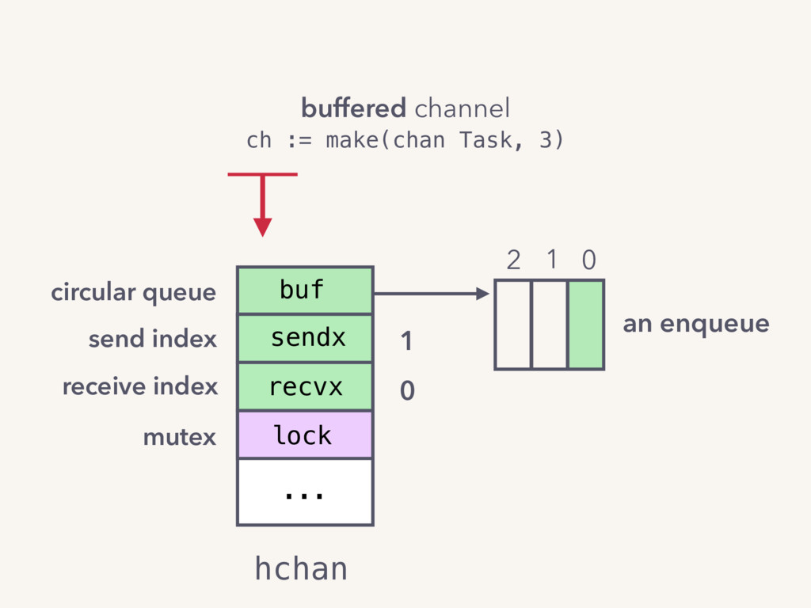
]

.content-credits[Kavya Joshi's https://speakerdeck.com/kavya719/understanding-channels?slide=16]

---

.left-column[
#### Counters

  * qcount
  * dataqsiz
  * sendx
  * recvx
]

.right-column[
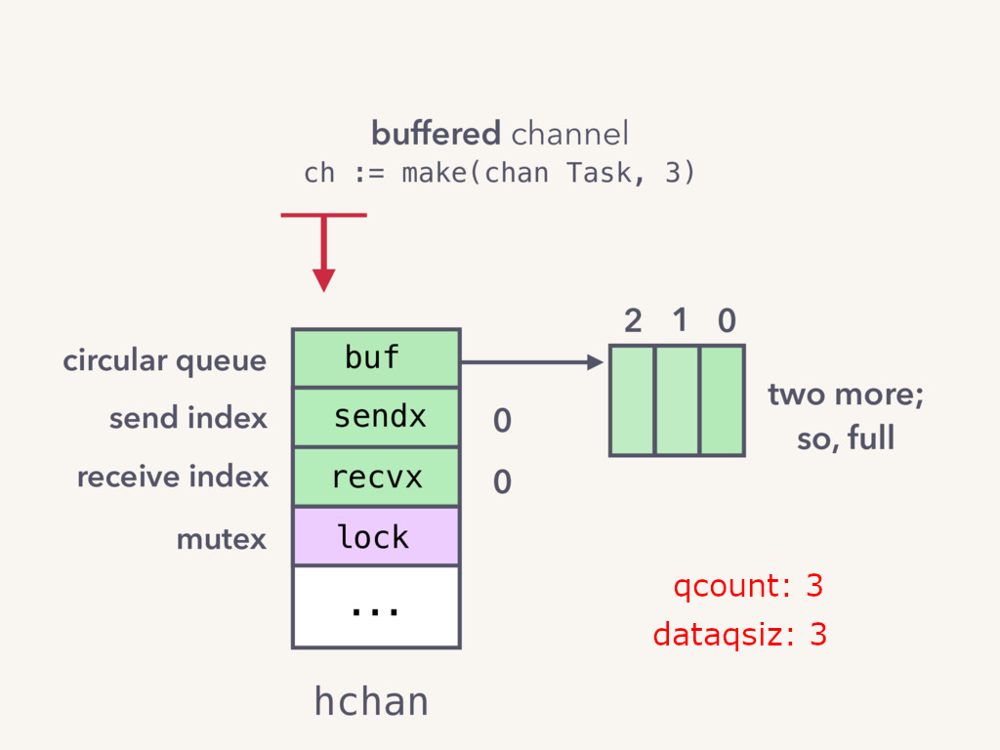
]

.content-credits[Kavya Joshi's https://speakerdeck.com/kavya719/understanding-channels?slide=17]

---

.left-column[
#### Counters

  * qcount
  * dataqsiz
  * **sendx**
  * **recvx**
]

.right-column[
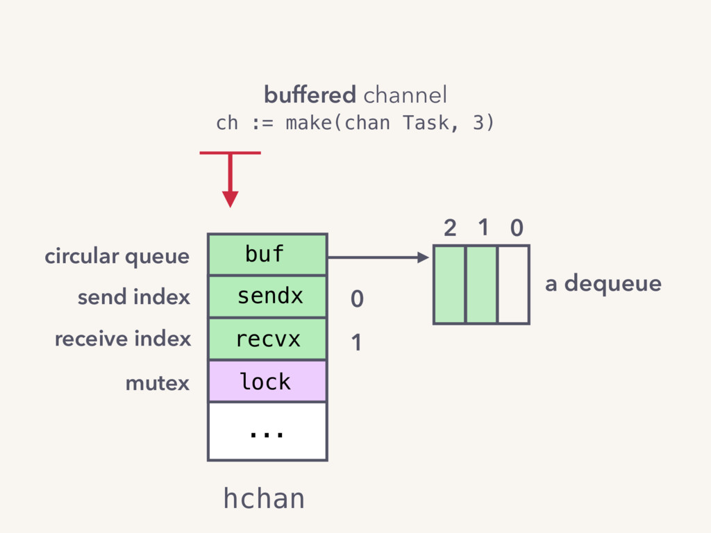
]

.content-credits[Kavya Joshi's https://speakerdeck.com/kavya719/understanding-channels?slide=18]

---

.left-column[
#### Flag
  * **closed**

#### Lock
  * lock
]

.right-column[
  Marks the channel as closed.
]

---

.left-column[
#### Flag
  * closed

#### Lock
  * **lock**
]

.right-column[
  A mutex which controls the access to the channel.
]

---

class: center, middle

# Seeing debugging in action!

---

### References

* Kavya Joshi's Gopher 2017 talk - [Understanding Channels](https://www.youtube.com/watch?v=KBZlN0izeiY)
* Ankur Anand's [Diving deep into Golang Channels](https://codeburst.io/diving-deep-into-the-golang-channels-549fd4ed21a8)
* Using delve debugger along with Visual Studio code

---

class: center, middle


Indie Software Engineer & Trainer

Volunteer / Co-organizer at Golang India & Gopher Chennai

ex-Consultant, ex-Tarka Labs, ex-BrowserStack, ex-ThoughtWorks

---

class: center, middle


Code
https://github.com/Chennai-Golang/go-concurrency-constructs/tree/concurrent

Slides
https://go-channels.slides.algogrit.com

.image-credits[Renee French]
